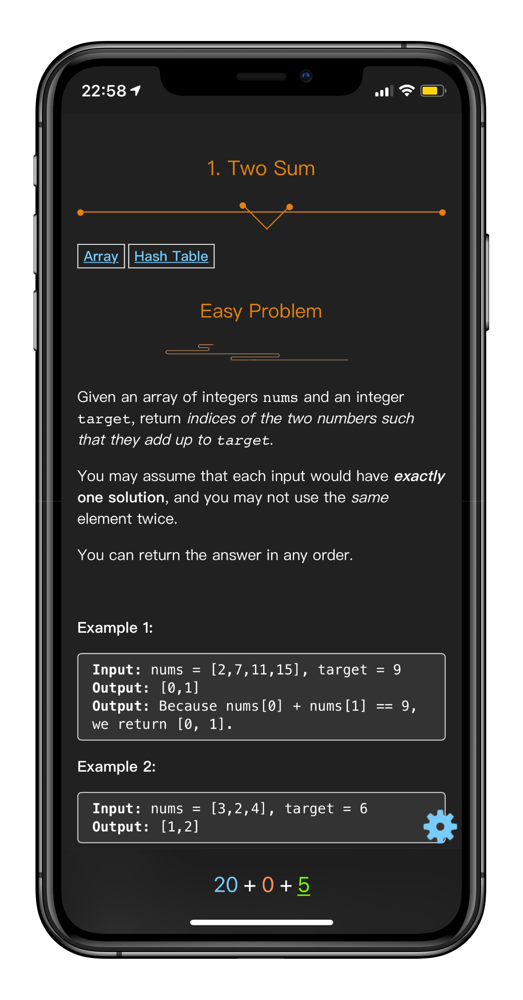
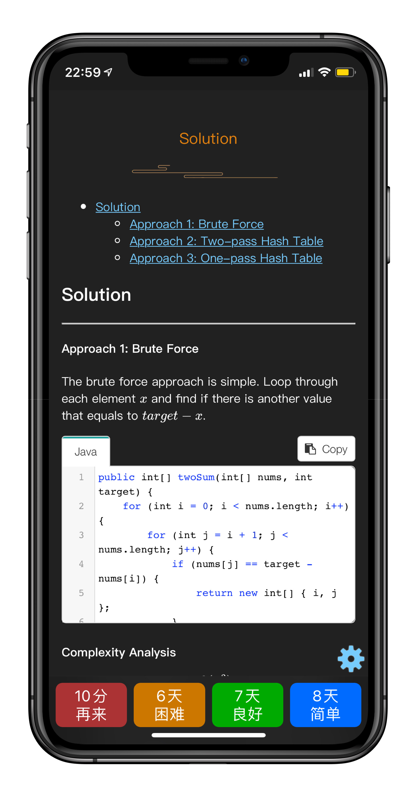

## 介绍

在刷LeetCode的过程中时常会遇到与之前类似的题目但是却忘记解题思路的情况。[Anki](https://apps.ankiweb.net/) 是一个基于遗忘曲线的全平台记忆工具，支持Mac，Linux， Windows， iOS和Andorid平台。Anki是一个优秀的记忆工具，但是在使用需要手动制卡，这个过程非常繁琐且耗时。

> Invest some time to automate or simplify a process to save more time in the future

**本项目旨在抓取LeetCode已AC的题目，并自动生成Anki卡组帮助记忆。**

抓取的数据包括：

1. 题目标题，难度，描述。
2. 官方题解（Premium的题解需要订阅才能抓取）。
3. 用户AC的提交代码。

## DEMO

|            正面            |           背面           |
| :------------------------: | :----------------------: |
|  |  |

示例[卡组](https://github.com/Peng-YM/LeetCode-Anki/blob/master/data/LeetCode.apkg?raw=true)

## 使用

首先Clone仓库并安装Python依赖
```bash
git clone https://github.com/Peng-YM/LeetCode-Anki.git
cd LeetCode-Anki
pip3 install -r requirements.txt
```

运行爬虫并输出Anki卡组到`./data/LeetCode.apkg` （由`project.conf`指定）。

```bash
python3 main.py
```

增加对Leetcode.cn的支持
```bash
python3 main_cn.py
```

首次运行需要获取cookie，运行`main.py`会打开一个Chrome窗口, 手动填写用户名和密码登陆一次即可。

> ⚠️ 注意：
> 1. 如果需要重新浏览器登陆，只需要删除目录下的`cookie.dat`即可。
> 2. 如果浏览器的驱动过期（目前为V86.0），请前往[下载Chrome的Selenium驱动](https://chromedriver.chromium.org/downloads) 并替换`vendor`的旧驱动。

愉快使用Anki复习做过的题目吧。

## 自定义

如果你不喜欢默认生成的Anki卡片样式，你可以修改`project.conf`里面的以下三个参数，自定义生成的Anki卡片。

```properties
[DB]
path = ./data
debug = False

[Anki]
front = ./templates/front-side.html
back = ./templates/back-side.html
css = ./templates/style.css
output = ./data/LeetCode.apkg
```

- `front`: 卡片正面的格式。
- `back`: 卡片背面的格式。
- `css`: 卡片的css样式。

## LICENSE

本项目基于GPL V3开源协议。

## Acknowledgements

本项目基于众多优秀的开源项目：

- [genanki: A Library for Generating Anki Decks](https://github.com/kerrickstaley/genanki)

- [Python Markdown: Python implementation of John Gruber's Markdown](https://github.com/Python-Markdown/markdown)
